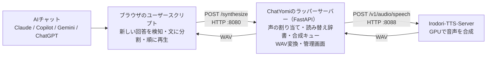

# ChatYomi — AIチャットの回答を好きな声で読み上げる

ChatYomiは、Claude、Microsoft Copilot、Gemini、ChatGPTの回答を、PCで動かすIrodori-TTSで読み上げます。ブラウザのユーザースクリプトが新しい回答を検知し、音声はローカルの[Irodori-TTS-Server](https://github.com/Aratako/Irodori-TTS-Server)で生成します。

AIチャットの標準の読み上げ音声が好みに合わず、回答を自分で選んだ声で聞きたい人向けのツールです。

読み上げる声は管理画面から登録でき、サイトごとに使い分けられます。回答の途中からの読み上げ、停止、直前の回答の再生にも対応しています。PCのほか、同じ家庭内Wi-FiにつないだAndroid端末でも利用できます。

## Windowsで使い始める

Windows 11、Python 3.11以上、Irodori-TTSを動かせるNVIDIA GPUが必要です。先に[Irodori-TTS-Server](https://github.com/Aratako/Irodori-TTS-Server)を公式手順で別フォルダーへ導入してください。

1. `setup.cmd` をダブルクリックし、Irodori-TTS-Serverのフォルダーを選びます。
2. `start.cmd` をダブルクリックします。準備ができると管理画面が開きます。
3. 管理画面で標準の声を試し、必要なら声を登録します。ブラウザへユーザースクリプトを追加します。
4. AIチャットの画面に表示される丸いボタンを一度押して有効にします。

毎回の起動は `start.cmd`、停止は `stop.cmd` で行えます。通常はIrodori-TTS v3を使用します。[モデルの切り替え方とv3を選んだ理由](docs/windows-onboarding.md#モデルを切り替える)も参照できます。各画面の操作とブラウザへの追加方法は[Windowsで使い始める](docs/windows-onboarding.md)を参照してください。

## Androidでも使う

先にPCで読み上げを確認し、声の登録もPCの管理画面で行います。Androidを追加するときは、PCの `config.yaml` でLANから接続できるようにし、APIトークンを設定してからChatYomiを再起動します。AndroidのFirefoxにユーザースクリプトを追加した後、読み上げ設定にも**同じトークン**を入力します。手順は[Androidで使う](docs/usage.md#androidで使う)を参照してください。

## 使い方と困ったとき

| 内容 | 案内 |
|---|---|
| ボタン操作、声の選択、読み方の調整 | [詳しい使い方](docs/usage.md) |
| 起動しない、音が鳴らない | [Windowsのトラブルシュート](docs/troubleshooting-windows.md) |
| 削除する | [Windowsから削除する](docs/uninstall-windows.md) |

音声ファイルや個人用の設定は各自の環境で用意します。配布物に声のデータは含まれません。

## 技術者向け：システム構成

ポート番号は既定値です。ブラウザにはPCのFirefoxまたはChromeを使用でき、AndroidではFirefoxから同じ家庭内ネットワーク上のChatYomiに接続します。Irodori-TTS-Serverは別途導入します。

## ライセンス

このリポジトリのコードと文書は[MIT License](LICENSE)で公開します。Irodori-TTS-Server本体・モデル・参照音声は含まれません。
